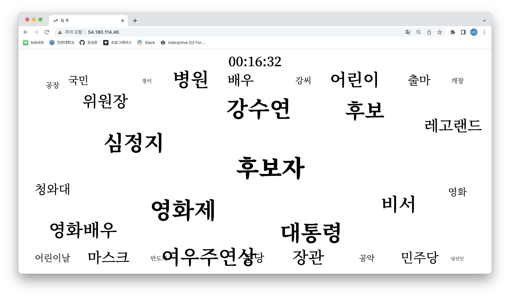
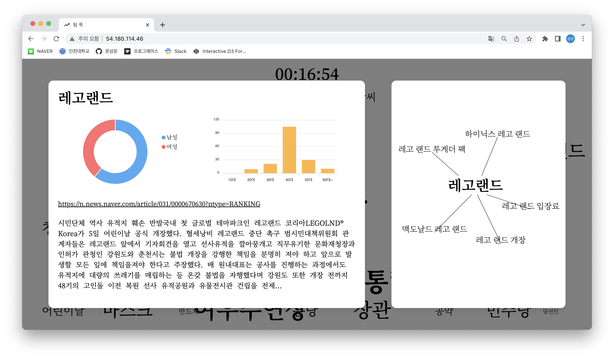

# 인천대학교 캡스톤 디자인

## 개요

- 실시간으로 이슈 된 키워드의 상세한 정보를 한눈에 확인할 수 있는 서비스

## 서비스

과거에는 네이버와 같은 대형 포털 사이트에서 실시간으로 많이 조회된 검색어 정보를 급상승 검색어라는 형태로 제공했었다. 하지만 네이버가 해당 서비스를 중단하면서 실시간으로 이슈를 파악하는 것이 어려워졌다. 이러한 문제를 해결하기 위해 실시간으로 이슈 된 키워드 30개와 각 키워드를 검색한 유저의 성별, 연령별 정보를 시각화하여 상세한 정보를 한눈에 파악할 수 있는 서비스를 개발하였다.

## 기술 스택

- Front-End
  - React
  - D3.js
- 배포
  - AWS EC2

## 결과

- http://54.180.114.46/

  
  

